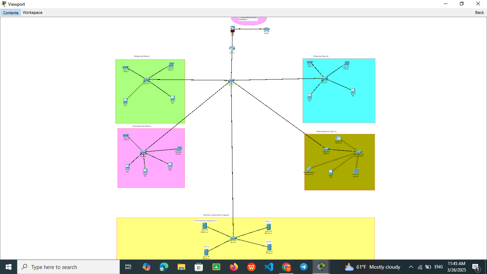

# College Network Design

This is my network design for the college. Below is the visual representation of the network.

 

## 📌 Project Overview  
This project is a **Local Area Network (LAN) design** for [Your College Name], created using **Cisco Packet Tracer**. It includes:  
- **Subnetting & IP Addressing**  
- **VLAN Implementation**  
- **Router & Switch Configuration**  
- **Wireless Network Setup**  
- **Security & Access Control**  

## 🛠 Tools & Technologies  
- **Cisco Packet Tracer**  
- **Networking Concepts (IP Subnetting, VLANs, Routing, etc.)**  

## 📷 Network Topology  
(Add a screenshot of your network diagram)  

## 🚀 Features  
✅ **Optimized IP Addressing**  
✅ **Secure VLAN Segmentation**  
✅ **Efficient Routing & Switching**  
✅ **Wireless Connectivity**   

## 📬 Contact  
📧 dagefalemma@gmail.com
🔗 https://degefa-lemma-personal-portifolio.netlify.app/

